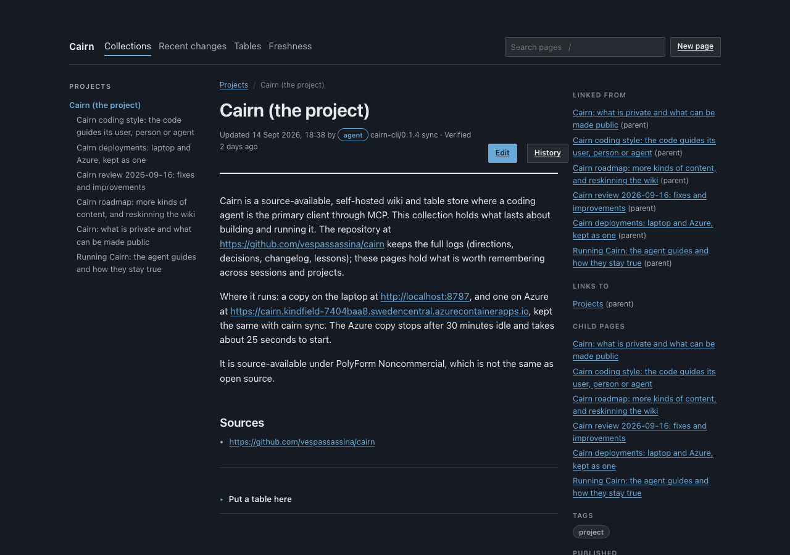

# Cairn

**A wiki and tables your agents can write to, with every change reviewable.**



Source-available and self-hosted: free for any non-commercial use. Agents write pages and table rows directly, with no approval step, and every write is a revision you can review in a small console and undo. One container and one SQLite file, on your machine, your own server or Azure's free grants.

Search finds pages by keyword and by meaning, with a small model that runs inside Cairn: no API key, and nothing leaves your server. Search by meaning works for English only; other languages get keyword search (ADR-021, ADR-022).

On a real 104-page wiki, with a set of 32 queries and their expected pages in `eval/queries.yaml`, search finds an answer in the top 5 for 97 percent of them (keyword alone: 88 percent), and returns nothing at all for the 9 questions the wiki does not answer. Run `pnpm eval` on your own Cairn to get your number.

Three doors for agents, over one core:

| Door | For | Context cost per session |
|---|---|---|
| `cairn` CLI and skill | agents with a shell: Claude Code, Codex | about 115 tokens until used |
| MCP | claude.ai, Claude Desktop, Cowork | about 7,200 tokens |
| REST at `/api/v1` | scripts, cron jobs, other agents | none |

Characters measured with `pnpm context-cost` on a 126-page wiki, tokens estimated at four characters each.

Status: early, and working. It runs on your machine, with the console, MCP, REST and the CLI, and deploys to your own server or Azure with sign-in through GitHub or any OpenID Connect provider. See `docs/ROADMAP.md`.

Source: https://github.com/vespassassina/cairn

## Install

### The easy way: let your agent do it

Most people will. Clone the repository, open it in Claude Code (or Codex, Cursor and so on), and say:

> Install Cairn for me.

The agent follows `docs/AGENT-INSTALL.md`. It asks whether Cairn should run on your computer, on your own server, or on Azure. It tells you exactly what to click where a person has to act, such as signing in to Azure or creating a GitHub OAuth app, and it keeps your secrets out of the chat.

```
git clone https://github.com/vespassassina/cairn.git
cd cairn
claude
```

### On your computer, by hand

Node 22 or later. Five commands, and `docs/LOCAL.md` has the detail:

```
corepack enable
pnpm install
pnpm import:markdown ~/notes
pnpm dev
claude mcp add --transport http --scope user cairn http://localhost:8787/mcp
```

The third line is optional: it brings in a folder of Markdown. Open http://localhost:8787 for the review console. No sign-in on your own machine (ADR-010). Start a new Claude session after adding the server.

For Claude Code, the `cairn` command with its skill costs less context than MCP. It runs on Windows, macOS and Linux; `docs/CLI.md` has the steps.

### On your own server

Proxmox, a NAS, any machine with Docker: one container, with the database in a folder on that machine's disk. You need an HTTPS address in front of it, from a reverse proxy or a tunnel. `docs/DEPLOY-DOCKER.md` has the steps; the short version:

```
cd deploy/docker
mkdir data && sudo chown 1000:1000 data
cp env.example .env
docker compose up -d
```

### On Azure

Reachable from anywhere, including Claude on the web and your phone, within Azure's free grants. `docs/DEPLOY-AZURE.md` walks through it; the short version is two runs of one script with an OAuth app created in between:

```
az login
deploy/azure/deploy.sh
```

## Your data

`cairn export <folder>` writes every page as a Markdown file, in folders that mirror your page tree, and every table as JSON. It needs no Cairn to read. `cairn import <folder>` reads it back into any Cairn, keeping ids and links, and running it twice changes nothing. Export everything, or one page and everything under it with `--root` (ADR-016).

`cairn sync <a> <b>` keeps two Cairns the same, such as your laptop and a cloud copy: changes and deletions go both ways, and when both sides changed a page, the two edits are merged as git merges a file; only where both changed the same lines does the newer win, and the other stays in its history (ADR-023, ADR-030). Add `--every 5m` to keep them in step.

## What exists

1. `packages/core`. Domain logic, the adapter interfaces (documents, search,
   auth records), and the conformance suites every adapter runs. No cloud
   dependencies.
2. `packages/adapter-sqlite`. The reference adapter, on Node's built-in
   `node:sqlite`: FTS5 for keyword search, and the sqlite-vec extension for
   search by meaning (ADR-022).
3. `packages/adapter-embeddings-local`. A small embedding model,
   bge-small-en-v1.5, running inside Cairn. **English only**: text in other
   languages gets keyword search.
4. `packages/api`. The Hono app: MCP over stateless streamable HTTP, the REST
   API and changes feed (ADR-013), the review console, the OAuth server
   (ADR-017), and the `import:markdown`, `reindex`, `eval` and `context-cost`
   commands.
5. `packages/cli`. The `cairn` command, with export and import (ADR-016),
   sync between two Cairns (ADR-023) and `cairn login`, and `skills/cairn`,
   the skill that teaches a coding agent to use it.
6. `Dockerfile`, `docker/`, `deploy/docker/` and `deploy/azure/`. The server
   image, with the model inside, and the deployments (ADR-018, ADR-020).

Not yet: AWS, the web editor, search by meaning in languages other than
English, attachments, and exporting history.

## Licence

PolyForm Noncommercial 1.0.0 (ADR-015). In plain words:

1. You may use, change and share Cairn, and build on it, for any non-commercial purpose: personal use, hobby projects, research, study, and use by charities, schools, public research bodies and government.
2. Commercial use, including by a company for its own work, needs a separate licence. Ask through https://github.com/vespassassina.
3. Keep the licence and its `Required Notice` line with any copy you share.

This makes Cairn source-available, not open source in the OSI sense, which does not allow restricting commercial use. `LICENSE` has the full terms.
